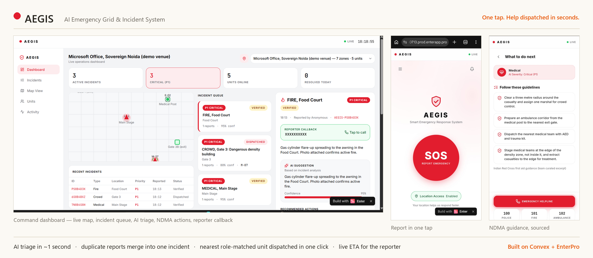

# AEGIS

AI Emergency Grid & Incident System, a venue operations prototype for crowd emergencies.

Someone inside a crowded venue taps SOS on their phone. AEGIS works out which zone they are in, scores how urgent it is, folds repeat reports of the same event into one incident, and puts it on the venue control room's live board so staff can send the nearest marshal, medic or fire team.

Finalist at Cognitive Chaos 2026 (Convex Open Innovation track). The finale was held at Microsoft Office, Noida, on 25 July 2026. Built by Team Ninja Coders.

**Live demo: https://developwithsourav.github.io/aegis-platform/**



## Try it

Open the demo in two tabs, or on a phone and a laptop.

| Screen | Route | What to do |
|---|---|---|
| Reporter | [`#/`](https://developwithsourav.github.io/aegis-platform/#/) | Tap SOS, pick a category and a zone, submit |
| Control room | [`#/command`](https://developwithsourav.github.io/aegis-platform/#/command) | Open the demo control room, select the incident, dispatch |
| Responder | [`#/responder`](https://developwithsourav.github.io/aegis-platform/#/responder) | Use the demo unit, pick the unit that was dispatched, accept |

The report reaches the board in about a second. Once a unit is dispatched, the reporter's screen shows who is coming and a live ETA, and none of the screens need a refresh.

Anyone can open the demo, so it runs with some limits. Everything resets every hour. Only the last two digits of a callback number are stored, photo upload is off, exit guidance is limited to the preset messages, and reports are rate limited. When no LLM key is configured, triage uses the rules and the guidance lookup. Please don't type real names or phone numbers into it.

## The problem

Venues already have police, medics and fire teams on site. What breaks down is information. Reports arrive late and get split across WhatsApp groups and walkie channels, one event gets reported thirty times, nothing is ranked by urgency, and dispatch is worked out by hand. In a crowd crush or a cardiac arrest, help still makes a difference for roughly 5 to 10 minutes. Hathras in 2024 (121 dead) and the Bengaluru stadium crush in 2025 (11 dead) both had staff on the ground, and neither had a shared live picture of what was happening.

In a dense crowd you can't hear or be heard, and the mobile network jams. A tap is a few hundred bytes, so it gets through when a voice call won't.

## AEGIS and 112

AEGIS does not replace 112. India's ERSS already connects a citizen to the state emergency system by call, SMS, app, panic button and location sharing.

112 doesn't give one venue a live view of its own ground. It doesn't dispatch that venue's marshals and medics, merge thirty reports of one crush into a single incident, or push exit guidance to the people standing inside. AEGIS is built for that venue-level job, and anything beyond the venue's own capacity should go to 112. That escalation is on the roadmap and isn't built yet.

## How it works

```
REPORT       One tap: category, zone (GPS or picked), optional note and callback number.
    |        No login, no OTP.
TRIAGE       Priority P1 to P4. Rules always run; an LLM can refine the summary when a key
    |        is configured. Response steps are retrieved from NDMA and first aid guidance.
DEDUPLICATE  Same category, same zone, within 2 minutes: merged into one incident with a
    |        report count.
DISPATCH     Nearest available unit whose role matches the category (medic for medical,
    |        fire squad for fire). Live ETA for the reporter.
ESCALATE     P1 incidents nobody has picked up after 60 seconds are escalated.
    |
AUDIT        Every step is written to an append-only timeline per incident.
```

The percentage on an incident card measures corroboration: 25 for one report and 20 more for each independent report of the same thing in the same place. In the build that was judged, the LLM graded its own confidence and gave a blank photo 95%, so the card no longer shows a model score.

Dispatch is a distance calculation. The AI suggests a priority and response steps, and an operator decides what to do with them. If the LLM call fails or no key is set, triage falls back to the rules and keeps working.

## Reading the code

The backend is about 1,100 lines of TypeScript in eight files, and the web app is one HTML page of about 1,000 lines. A good order to read it in:

1. [`convex/schema.ts`](convex/schema.ts): the seven tables. Start here to see what the system stores.
2. [`convex/incidents.ts`](convex/incidents.ts): `submitReport` is the core path. It locates the report, merges it with an open incident or opens a new one, and schedules triage and escalation. Dispatch and the rest of the lifecycle follow.
3. [`convex/ai.ts`](convex/ai.ts): `triage` retrieves procedures, runs the rules, optionally asks an LLM, and writes the result back.
4. [`convex/model.ts`](convex/model.ts): distance, ETA, corroboration and the category-to-role map, with no database access.
5. [`convex/venues.ts`](convex/venues.ts) and [`convex/seed.ts`](convex/seed.ts): venue data, the procedure library and resets.
6. [`web/index.html`](web/index.html): the reporter, responder and control room screens. Every call to the backend is in the adapter block near the top of the script.

## Stack

The backend runs on [Convex](https://convex.dev): reactive queries, mutations, scheduled functions, a cron job, vector search and file storage. The web app is a single static `index.html` (React with htm, no build step) served from GitHub Pages. Triage can use Gemini, OpenAI or Anthropic, with the rules as the fallback.

```
convex/
  schema.ts       tables and indexes
  incidents.ts    reporting, deduplication, dispatch, lifecycle, broadcasts, live queries
  ai.ts           triage and procedure retrieval
  model.ts        pure helpers
  venues.ts       venue catalogue and switching
  seed.ts         seed data and resets
  crons.ts        hourly reset for the public demo
  http.ts         REST endpoints for clients that can't use the Convex library
web/index.html    the web app
docs/             finale deck and screenshots
SUBMISSION.md     the competition record
```

## Run it yourself

```bash
npm install
npx convex dev          # creates a dev deployment and pushes functions on save
npm run seed            # venue, units and the procedure library
npm run app             # web app at http://localhost:4320
```

Point `CONVEX_URL` near the top of `web/index.html` at your own deployment. `npm run typecheck` checks the backend.

Settings live in environment variables on the Convex deployment, never in this repo. See [`.env.example`](.env.example).

| Variable | Purpose |
|---|---|
| `OPERATOR_EMAIL`, `OPERATOR_PASSWORD` | Control room login. With no password set, nobody can log in. |
| `RESPONDER_PASSCODE` | Shared passcode for responder devices |
| `LLM_PROVIDER` and the matching key | Turns on LLM triage. Leave empty for rules only. |
| `DEMO_MODE=1` | Public demo limits and the hourly reset |

## The competition build

The code that was judged is frozen at the tag [`v1.0-hackathon`](https://github.com/developwithsourav/aegis-platform/tree/v1.0-hackathon), along with the working material from the event. [`SUBMISSION.md`](SUBMISSION.md) records what ran on the day, what the judges criticised and how each point was fixed. The finale deck is in [`docs/AEGIS_Finale_Deck.pdf`](docs/AEGIS_Finale_Deck.pdf).

## Team

| Member | Worked on |
|---|---|
| Sourav Kumar | Frontend, design system, pitch |
| Siddharth Singh | Convex data core: schema, deduplication, dispatch |
| Rajat Kushwaha | AI triage, retrieval, LLM providers |
| Manish Joshi | Integration, deployment, frontend to Convex bridge |

ARSD College, University of Delhi.
